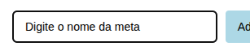
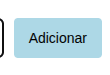
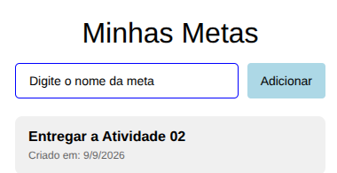
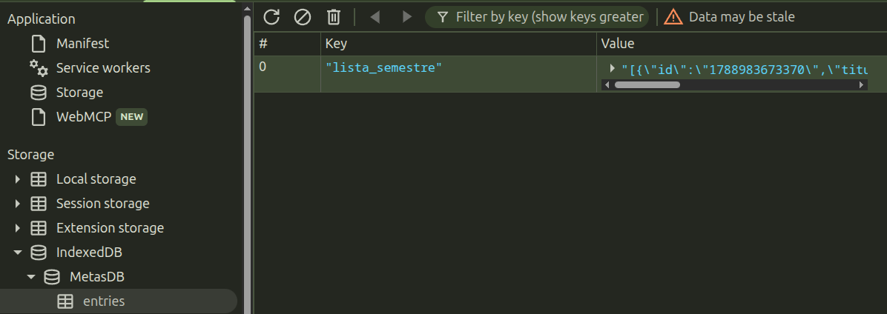
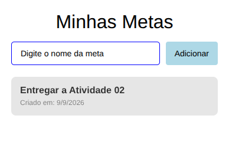
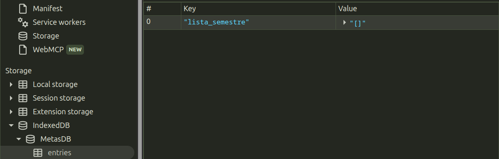

## Como utilizar o gerenciador de metas?


---

### Adicionando uma meta
Para criar uma meta basta escrever o nome dela.



E em seguida, apertar em Adicionar.



Ao adicionar uma meta, aparecerá da seguinte maneira.



_Como deve aparecer no banco de dados web?_



Ao adicionar uma meta, a aplicação busca o conjunto de dados, monta em um array usando o _spread operator (...dados)_ e a nova meta. Após isso, o _Async Storage_ salva esse novo conjunto de dados no IndexedDB, utilizando a mesma chave, pois, desta forma, reescreve os dados desatualizados evitando duplicidade.

---

### Excluíndo uma meta

Para remover uma meta é simples, basta clicar e segurar por meio segundo (500ms) e uma interface de confirmação irá surgir.




Essa é a forma para funcionar apenas na versão web do React Native, inclusive é utilizado o módulo _Plataform_ do React Native para identificar o sistema.

Ao recarregar o banco de dados, é possível nota que o mesma está vazio.



---

### Como funciona o carregamento automático?

Utilizando do conceito de _Lifting state up_ do React, as funções de modificação de um mesmo elemento (banco de dados) feita por componentes irmãos diferentes (adicionar meta e excluir meta) devem ficar no componente pai, e assim repassar como props. Logo, ao carregar a aplicação, os dados devem ser carregados também, e para alcançar tal comportamento deve-se utilizar do _useEffect_ no pai (App.js).

```js
// Executado em App.js
  useEffect(() => {
    buscarMetas();
  }, []);
```